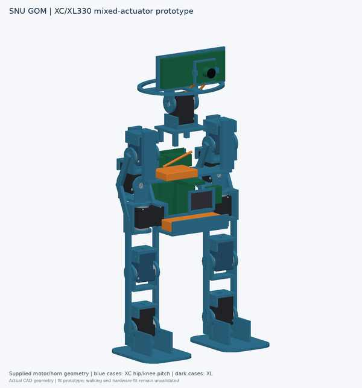

# SNU GOM · 스누곰

[English](#english) · [한국어](#한국어)

<a id="english"></a>

## English

**A small bear-shaped biped designed to walk, look at people and respond through voice and movement.** SNU GOM combines a ten-joint lower body with a tilting head, a camera in its nose, microphones and a speaker.

### The design

| Part | Current design |
| --- | --- |
| Legs | Five serial motors per leg: XC330 at hip pitch and knee pitch; XL330 at hip roll, hip yaw and ankle pitch |
| Head | One XL330 neck-pitch motor to look up and down; 11 motors overall |
| Nose | Camera faces straight ahead within the head; the neck changes its viewing angle |
| Arms | Fixed bear-shaped arms |
| Electronics | Proposed Pi 4 for camera/audio/API work; OpenRB-150 for motor communication; torso IMU |
| Interaction | Voice input/output, camera perception and external APIs; implementation in progress |

Walking, waddling and expressive responses are development goals. They have not been demonstrated on the physical robot.

### Explore the project

| I want to… | Open |
| --- | --- |
| Understand the robot | [Project overview](docs/PROJECT_BRIEF.md) |
| See the mechanical CAD design | [CAD geometry and layout](docs/CAD_GEOMETRY.md) · [CAD files and status](hardware/mechanical/README.md) |
| Understand camera, voice and APIs | [HRI design](docs/HRI.md) |
| Check wiring and parts | [Electronics](docs/ELECTRONICS.md) · [BOM and costs](hardware/bom/README.md) |
| Run the existing model | [Simulation guide](docs/SIMULATING_MOTION.md) |
| Find papers and videos | [Research](docs/RESEARCH.md) · [BD-X / Olaf design changes](docs/PAPER_DESIGN.md) |
| Make a change | [Branch, commit and PR guide](CONTRIBUTING.md) |
| See what comes next | [Roadmap](docs/ROADMAP.md) · [Open tasks](https://github.com/mjcha924/snu-gom/issues) |

### Try the existing model

```bash
git clone https://github.com/mjcha924/snu-gom.git
cd snu-gom
python -m venv .venv
source .venv/bin/activate
python tools/check_project.py
python -m pip install -r requirements-gom-viewer.txt
python tools/view_robot.py --mode pose
```

On Windows PowerShell, activate with `.venv\Scripts\Activate.ps1`. Python 3.11 is recommended. The current viewer is an earlier **ten-leg-joint proxy** with a fixed base. It has not yet been updated to the detailed CAD or moving neck, and it does not simulate validated walking. See [validation status](docs/GOM_VALIDATION.md).

### Current work

**CAD v0.7:** the full shell is 403 mm (40.3 cm) tall; two stronger XC330s per leg now serve hip pitch and knee pitch. The head horn support is no longer clipped by the head-envelope trim. Shell-on and skeleton STEP assemblies are included. [CAD files, dimensions and limits](hardware/mechanical/README.md).

#### CAD previews

| Shell exterior | Skeleton |
| --- | --- |
|  |  |

See [CAD files and dimensions](hardware/mechanical/README.md) for the P-R-Y motor arrangement and model variants. These are design previews, not manufacturing drawings. The older v0.3 and v0.5 concepts remain in the history.

The current repository includes compressed STEP assemblies and the exact supplied XL330 motor/horn geometry in the CAD exports. A new Onshape document and fabrication-qualified CAD have not been created. Next: verify one joint, test one leg under load, complete wiring, update the simulation model and bench-test conversation. The HRI API design exists; an HRI runtime is not implemented yet.

---

<a id="한국어"></a>

## 한국어

**CAD v0.7:** 전체 외장 높이 403 mm(40.3 cm)를 유지합니다. 다리의 고관절 피치·무릎 피치에는 XC330, 롤·요·발목 피치에는 XL330을 배치했습니다. 머리 모터 혼 지지부를 외형 Boolean으로 자르지 않도록 수정했습니다. [CAD 파일·치수·한계](hardware/mechanical/README.md).

**걷고, 사람을 바라보고, 말과 동작으로 반응하는 작은 곰 모양 이족보행 로봇입니다.** 다리 10축에 위아래로 움직이는 머리, 코 카메라, 마이크와 스피커를 결합합니다.

### 기본 구성

| 부분 | 현재 설계 |
| --- | --- |
| 다리 | 다리당 직렬 모터 5개: 고관절 피치·무릎 피치는 XC330, 롤·요·발목 피치는 XL330 |
| 머리 | 목 피치 XL330 1개로 위아래 보기; 전체 11개 모터 |
| 코 | 머리 기준 정면 카메라; 목 움직임으로 시선 각도 변경 |
| 팔 | 고정된 곰 모양 팔 |
| 전장 | 카메라·음성·API용 Pi 4, 모터 통신용 OpenRB-150, 몸통 IMU 후보 |
| 상호작용 | 음성 입출력·영상 인식·외부 API; 구현 진행 전 설계 단계 |

보행·뒤뚱거림·표현 동작은 개발 목표이며 실물에서 검증된 기능은 아닙니다.

### 원하는 내용 찾기

| 궁금한 내용 | 문서 |
| --- | --- |
| 로봇의 목표와 구성 | [프로젝트 개요](docs/PROJECT_BRIEF.md) |
| 기구 CAD 설계 | [CAD 형상·기구 배치](docs/CAD_GEOMETRY.md) · [CAD 상태](hardware/mechanical/README.md) |
| 카메라·음성·API | [HRI 설계](docs/HRI.md) |
| 전장·구매·가격 | [전장](docs/ELECTRONICS.md) · [BOM과 예산](hardware/bom/README.md) |
| 모델 실행 | [시뮬레이션 안내](docs/SIMULATING_MOTION.md) |
| 논문·영상 | [자료조사](docs/RESEARCH.md) |
| GitHub에 변경 올리기 | [브랜치·커밋·PR 안내](CONTRIBUTING.md) |
| 앞으로 할 일 | [개발 순서](docs/ROADMAP.md) · [작업 목록](https://github.com/mjcha924/snu-gom/issues) |

위 실행 명령은 기존 다리 10축 도형 모델을 보여줍니다. 상세 CAD·목 피치는 아직 반영하지 않았으며 고정 베이스의 관절 확인용입니다. 보행 검증은 아닙니다. [검증 상태](docs/GOM_VALIDATION.md)를 확인하세요.

v0.7 STEP 배포 파일은 이번 검토에 별도 제공했습니다. 이 GitHub 변경에는 영어·한국어 설계 문서와 미리보기만 있고 대용량 STEP 바이너리는 포함하지 않았습니다. 전체 높이는 약 40.3 cm입니다. 새 Onshape 문서나 제작 검증 CAD는 아직 없습니다. 다음은 관절 시편 → 한쪽 다리 하중 시험 → 배선 → 모델 갱신 → 정지 상태 대화 시험입니다. HRI API 설계는 있지만 실행 서버는 아직 없습니다.

---

`robot/` model · `hardware/` CAD/electronics/BOM · `firmware/` communication · `simulation/` learning · `docs/` project notes. Earlier nine-joint material is kept under [legacy documentation](docs/legacy/README.md). / 이전 9축 자료는 별도 보관합니다.
