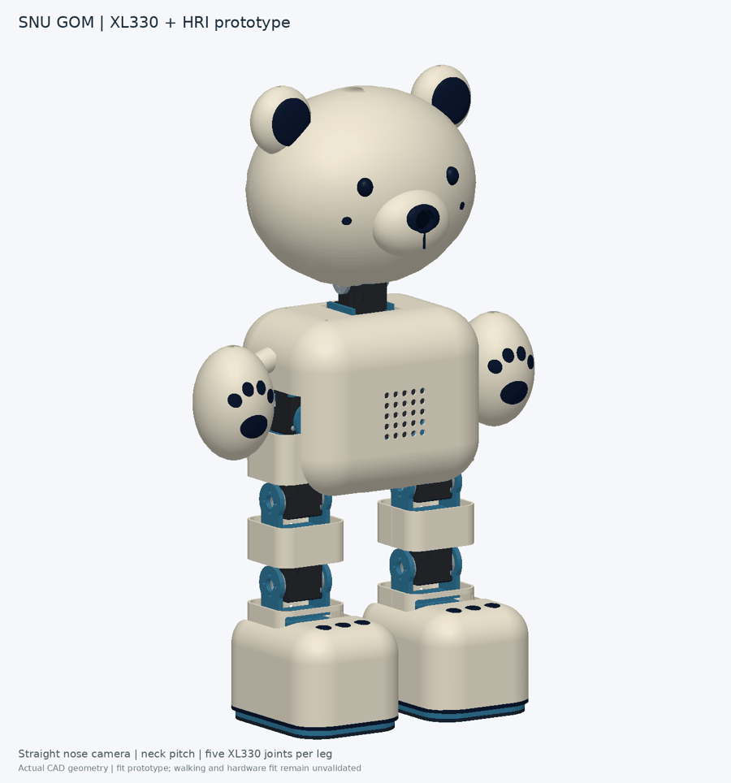
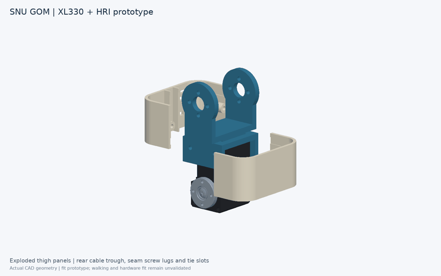
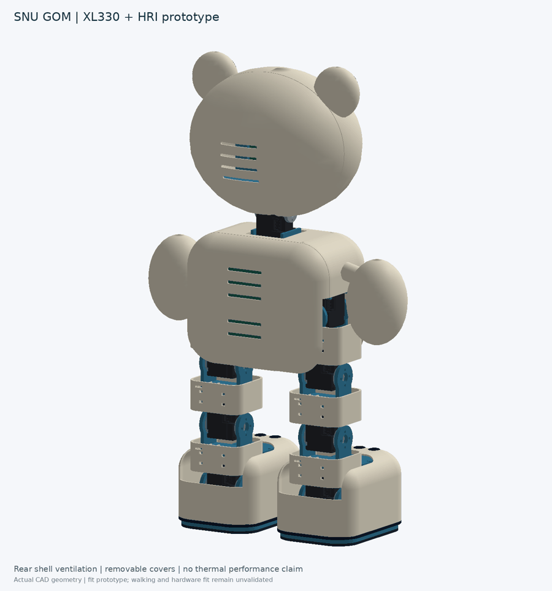

# CAD geometry and assembly / CAD 형상과 조립 구조

**Revision / 버전: v0.3 — lighter shells, ventilation and sole pads / 경량 외장·통풍·발바닥 패드**

[Why the papers changed this design / 논문 반영 근거](PAPER_DESIGN.md)

This page explains how the detailed CAD fits together. The v0.3 package has full shell-on and exposed-skeleton STEP assemblies, plus paired-leg and single-leg close-ups. All dimensions below are in **millimetres**.

상세 CAD를 이해하기 위한 안내입니다. 전체 STEP에서 외형을 확인한 뒤 외장과 접촉 패드를 숨기면 내부 기구를 볼 수 있습니다. 아래 치수는 모두 **mm**입니다.

## 1. What moves / 움직이는 부분

There are **11 XL330-M288-T motors**: five in each leg and one for head pitch. The arms are fixed. The camera points straight out of the nose; looking upward means rotating the entire head.

**XL330-M288-T 11개**를 사용합니다. 다리마다 5개, 목 피치 1개이며 팔은 고정입니다. 코 카메라는 머리 기준 정면을 보고, 사람을 올려다볼 때 머리 전체가 회전합니다.

| Chain / 연결 순서 | Motion / 역할 |
| --- | --- |
| Torso → hip roll / 몸통 → 고관절 롤 | Sideways leg tilt / 다리 좌우 기울이기 |
| Hip roll → hip pitch / 고관절 피치 | Swing leg forward/back / 다리 앞뒤 움직임 |
| Hip pitch → knee pitch / 무릎 피치 | Bend knee / 무릎 굽히기 |
| Knee pitch → ankle pitch / 발목 피치 | Foot toe-up/toe-down / 발 앞뒤 기울이기 |
| Ankle pitch → ankle roll / 발목 롤 | Foot side tilt / 발 좌우 기울이기 |
| Torso → neck pitch / 몸통 → 목 피치 | Raise/lower gaze / 시선 위아래 조절 |

The ankle-pitch and ankle-roll axes are offset rather than intersecting. A dogleg adapter reaches forward to the roll motor. This keeps the existing five-motor packaging, but the offset must be represented in inverse kinematics and simulation.

발목 피치와 롤 축은 한 점에서 만나지 않습니다. 꺾인 브래킷이 전방의 롤 모터까지 연결합니다. 5모터 배치를 유지하기 위한 구조이며 역기구학·시뮬레이션에도 이 오프셋을 반영해야 합니다.

## 2. Coordinate system and dimensions / 좌표와 치수

**+X = front, +Y = robot's left, +Z = up.** The structural sole bottom is Z=0; the new 2 mm contact pad extends to Z=−2 in the neutral assembly. `+44 / −44` means left/right leg, respectively. CAD joint angles are not calibrated servo commands.

**+X 전방, +Y 로봇의 왼쪽, +Z 위쪽**입니다. 중립 자세 구조 발판 바닥은 Z=0, 새 접촉 패드 바닥은 Z=−2이고 `+44 / −44`는 왼쪽/오른쪽 다리입니다. CAD 각도는 실물 모터의 교정된 명령값이 아닙니다.

| Joint / 관절 | Origin XYZ / 축 원점 | Axis / 축 | Motor IDs / ID |
| --- | --- | --- | --- |
| Hip roll / 고관절 롤 | (0, ±44, 172) | +X | 1 / 6 |
| Hip pitch / 고관절 피치 | (0, ±44, 124) | +Y | 2 / 7 |
| Knee pitch / 무릎 피치 | (0, ±44, 76) | +Y | 3 / 8 |
| Ankle pitch / 발목 피치 | (0, ±44, 28) | +Y | 4 / 9 |
| Ankle roll / 발목 롤 | (40, ±44, 22) | +X | 5 / 10 |
| Neck pitch / 목 피치 | (0, 0, 247) | +Y | 11 |

Positive neck pitch in this CAD looks downward; negative pitch looks upward. Verify every motor's actual zero and direction before operation. / 이 CAD에서 목 피치 양수는 아래, 음수는 위를 향합니다. 작동 전 실물 모터의 영점·방향을 확인합니다.

| Geometry / 형상 | Value / 값 |
| --- | --- |
| Hip spacing / 고관절 간격 | 88 |
| Hip pitch → knee → ankle pitch / 피치 축간 거리 | 48 + 48 |
| Structural sole / 구조 발판 | 88 × 66 × 3; centre X=20 |
| Paw cover outside / 발 외장 | 94 × 70 footprint; top Z≈59.4 before inlays / 인레이 제외 |
| Torso envelope / 몸통 외곽 | 92 × 124 × 102; centre Z=179 |
| Leg rigid cover section / 다리 경질 외장 단면 | 42 × 46 |
| Cosmetic skin / 외장 두께 | 1.2 in lightened zones; 1.6 end bands and preserved mounts / 경량 구간 1.2·끝단 1.6·고정부 유지 |
| Replaceable contact pad / 교체형 접촉 패드 | 2 thick, 88 × 66 outline; material pending / 두께 2·재질 미정 |
| Rear cable trough / 후면 배선 홈 | 6 clear width / 내부 폭 |
| Main joint plate / 주요 관절 판 | 3 |

See [joint coordinates](../hardware/mechanical/joint_frames_v03.json), [design parameters](../hardware/mechanical/parameters_v03.json) and `parts_manifest.json` inside the CAD package for machine-readable coordinates and per-part bounds. / 정확한 좌표와 부품별 외곽은 CAD 패키지의 JSON 파일을 기준으로 합니다.

## 3. Real motors and custom brackets / 실제 모터와 자체 브래킷

Every motor instance contains the **15 solids from the supplied XL/XC-330 STEP**, including the case, output horn, opposite idler, screws and connectors. Only rigid placement transforms are applied. Other electronics are provisional packaging envelopes.

각 모터는 제공된 XL/XC-330 STEP의 **솔리드 15개**를 사용합니다. 케이스·출력 혼·반대편 아이들러·나사·커넥터를 포함하며 위치·방향만 변환합니다. 모터 외 전장품은 배치 검토용 외곽 형상입니다.

| Interface / 체결 기준 | Measured or designed value / 기준 치수 |
| --- | --- |
| Supplied case / 제공 케이스 | 20 × 34 × 23 |
| Horn–idler mating span / 혼–아이들러 체결면 간격 | 29; shifted local axial coordinates ±14.5 |
| Supplied horn / 제공 혼 | Ø16; four Ø1.6 holes on Ø12 bolt circle |
| Custom yoke / 자체 요크 | Ø2.2 screw clearance; Ø7.8 centre tool access |
| Tail saddle / 후단 새들 | 2.5 side plates; 0.35 nominal case clearance |

The intended load path is **sole → ankle yoke/adapter → shin → thigh → hip gimbal → pelvis deck**. The bear covers conceal this structure; they are not intended to carry the robot's walking loads. Case-hole fastening suitability and screw engagement still need checking on one actual motor. A matching hole centre does not establish an approved mounting method.

설계상 하중은 **발판 → 발목 요크·어댑터 → 종아리 → 허벅지 → 고관절 짐벌 → 골반 데크**로 전달합니다. 곰 외장은 내부를 가리는 부품이며 보행 하중을 지지하는 골격이 아닙니다. 케이스 구멍의 체결 용도와 나사 물림 깊이는 실물 모터로 확인해야 합니다. 구멍 위치가 맞는 것만으로 체결 방법이 확정되지는 않습니다.

## 4. Paws, leg covers and hidden wiring / 발·다리 외장과 배선

The v0.3 feet retain a continuous rounded toe box, low toe inlays, a separate dark bumper and mounting bosses accessed from the sole. The rigid-panel baseline leaves the rear ankle opening and joint gaps open; the explicit shell-on STEP pairs link panels with neutral sleeve envelopes across the gaps, while the skeleton STEP exposes the load path. Hand pads follow the curved arm surface and use four small toe beans above an oval palm. The fixed arms move 9 mm outward and 8 mm upward to clear the hip covers.

v0.3 발은 하나로 이어진 둥근 앞부분, 낮은 발가락 인레이, 분리형 어두운 테두리와 발판 쪽에서 접근하는 고정부로 구성합니다. 기본 경질 외장안의 뒤쪽 발목 개구와 관절 틈은 열려 있으며 유연 은폐 외피는 별도 비교안입니다. 손바닥 패드는 팔 곡면을 따라가며 타원형 중심 패드 위에 작은 발가락 패드 4개를 배치합니다. 고관절 외장 간섭을 줄이기 위해 고정 팔을 바깥쪽 9 mm, 위쪽 8 mm 이동했습니다.

| Part family / 부품군 | Attachment and service / 고정·정비 |
| --- | --- |
| `hip_shell_front/rear` | Follows hip-roll link; encloses hip-pitch motor region / 고관절 롤 링크에 부착해 피치 모터 주변을 덮음 |
| `thigh_shell_front/rear` | Follows hip-pitch link / 고관절 피치 링크와 함께 움직임 |
| `shin_shell_front/rear` | Follows knee-pitch link / 무릎 피치 링크와 함께 움직임 |
| `*_sole_pad` | Separate foam/elastomer contact sample, adhesive trial; 4 access holes / 분리형 폼·탄성체 접촉 시편·접착 시험·접근공 4개 |
| `design_studies/*_flex_gaiter` | Neutral soft-sleeve envelope; included in `*_shell.step`, omitted from rigid-panel baseline and skeleton / 중립 유연 커버 외곽. `*_shell.step`에 포함하며 경질 패널 기준안·골격형에서는 제외 |
| `paw_cover` | Follows ankle-roll output/sole / 발목 롤 출력·발판과 함께 움직임 |

Each rigid cover separates into front and rear panels with a **0.4 mm seam**. Prototype seam lugs have a rear Ø2.2 clearance hole and front Ø1.6 pilot for a trial M2 fastening scheme. Rear tie slots allow retention to the custom link; the strap path and retention strength need a fit build. The inner rear trough reserves 6 mm width for the motor harness; the hip guide is shallower and shifted toward the outer side to clear the roll yoke. The shin front panel has a lower clearance notch for the ankle adapter.

경질 외장은 앞·뒤 패널로 분리되며 **이음 틈 0.4 mm**를 둡니다. 시험용 M2 체결부는 뒤쪽 Ø2.2 관통공, 앞쪽 Ø1.6 파일럿 홀입니다. 후면 타이 슬롯으로 자체 링크에 고정하는 방식이며 타이 경로·고정 강도는 조립 시험 대상입니다. 후면 안쪽에는 모터 배선을 위한 폭 6 mm 홈이 있습니다. 고관절 홈은 롤 요크를 피해 얕게 만들고 바깥쪽으로 이동했습니다. 종아리 앞판 아래에는 발목 어댑터 회전 공간을 남겼습니다.

Route the motor harness down the rear channel, leave a service loop at each rotating joint, and restrain the cable on both adjoining links away from the horn and yoke. Rear covers should come off without removing the motor. Exact cable lengths, connector passage and bend radius are not yet modeled.

모터 배선은 후면 홈을 따라 내려가고 각 회전 관절에 여유 루프를 둡니다. 혼·요크를 피해 양쪽 링크에 케이블을 고정하며, 모터를 분해하지 않고 후면 커버를 열 수 있게 합니다. 케이블 길이·커넥터 통과·최소 굽힘 반경은 아직 확정하지 않았습니다.

**The joint sleeves are neutral soft-part design envelopes under `design_studies/`; they are included in the shell-on STEP and excluded from the rigid-panel baseline and skeleton.** Their neutral STEP shapes cannot be treated as rigid parts during motion. Fabric or a soft elastomer sleeve must be patterned and tested for folding, snagging and ventilation. Ordinary rigid filament would bridge the joints and restrict motion. Hide these envelopes when posing the rigid mechanism.

**관절 슬리브는 `design_studies/`의 중립 유연 부품 외곽입니다. 외장형 STEP에는 포함하고 경질 패널 기준안·골격형에서는 제외합니다.** 중립 STEP 형상을 경질 부품처럼 회전시키면 안 됩니다. 천 또는 부드러운 탄성체로 접힘·끼임·통풍을 시험해야 합니다. 일반 경질 필라멘트로 그대로 출력하면 관절 움직임을 제한합니다. 강체 자세를 확인할 때는 이 부품을 숨깁니다.

The v0.3 head back has four vent slots, the torso back five, and each rear leg panel one. These are geometric airflow openings, not a proven cooling solution. The lightened skins require print/stiffness checks. / v0.3은 머리 뒤 4개·몸통 뒤 5개·각 다리 후면 패널 1개 통풍 슬롯을 추가합니다. 방열 효과와 얇아진 외장 강성은 실측 대상입니다.

## 5. Head and torso packaging / 머리와 몸통 배치

| Location / 위치 | Components / 부품 |
| --- | --- |
| Nose / 코 | Straight camera and dark lens bezel / 정면 카메라·어두운 베젤 |
| Head / 머리 | Camera carrier, microphone/audio board, neck output carrier / 카메라·마이크 보드·목 출력 캐리어 |
| Rear torso / 몸통 뒤 | Vertical Pi 4, OpenRB controller behind hip covers / 세로 Pi 4·고관절 외장 뒤 OpenRB |
| Lower torso / 몸통 아래 | Battery near centreline / 중심선 근처 배터리 |
| Torso centre / 몸통 중앙 | IMU, separate logic/motor power modules / IMU·로직/모터 전원 모듈 |
| Belly / 배 | Speaker and grille / 스피커·그릴 |

The OpenRB envelope moves to X=−27.3, Y=22, Z=167, and the IMU to (13,0,166) for the leg-cover revision. The controller is now upright with its 66 mm side along Z; the battery tray has a rear-corner clearance relief. Board mounting holes, connectors, thermal clearance and acoustic details remain provisional. The straight camera mounting angle stays **0°**. / 외장 공간 확보를 위해 OpenRB 중심은 (−27.3,22,167), IMU는 (13,0,166)으로 이동합니다. 컨트롤러의 66 mm 변은 Z 방향으로 세우고 배터리 트레이 뒤 모서리에 간섭 회피 절삭을 추가했습니다. 기판 체결·커넥터·방열·음향은 추가 설계 대상이고 카메라 장착각은 **0°**를 유지합니다.

## 6. Open and edit the CAD / CAD 열기와 수정

1. Start with `SNU_GOM_leg_pair_shell.step` or `SNU_GOM_leg_pair_skeleton.step`; use the matching full-robot STEP for exterior review. / 양쪽 다리 STEP를 먼저 열고 전체 STEP는 외형 확인에 사용합니다.
2. Identify parts by name; left/right and front/rear panels export separately under `parts/`. / 이름으로 부품을 구분하며 좌우·앞뒤 패널은 개별 파일입니다.
3. Recreate revolute mates from `joint_frames.json`. STEP contains shape placement, not an actuated mechanism. / 관절 JSON으로 회전 구속을 구성합니다. STEP만으로 관절이 구동되지는 않습니다.
4. For source edits, install `requirements-cad.txt`, edit `source/build.py`, `source/refine_shells.py` and `source/refine_papers.py`, then run the package's rebuild commands. / 소스 수정은 세 Python 생성 파일에서 진행합니다.
5. Print the joint coupon, then one cover pair and one foot before making the whole robot. / 관절 시편 → 커버 한 쌍·발 하나 순서로 먼저 검증합니다.

See [CAD files and status](../hardware/mechanical/README.md) for package contents and [verification notes](CAD_VERIFICATION.md) for STEP checks. The repository's existing URDF is still the earlier ten-leg-joint proxy and **does not match this CAD revision**. / 패키지 구성과 STEP 검사 결과는 링크를 참고하세요. 기존 10축 도형 URDF는 **현재 CAD와 일치하지 않습니다**.
