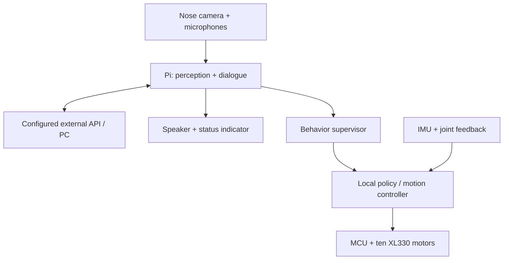

# Human–robot interaction / 인간–로봇 상호작용

[English](#english) | [한국어](#한국어)

## English

**Requirement update, 2026-09-29:** SNU GOM should see, hear and speak, connect to external APIs, and express responses through robot behaviors. The forward-facing camera lens occupies the bear's nose. Ten XL330-M288-T leg motors remain confirmed; the head gains one XL330 neck-pitch joint and the arms remain fixed (11 motors total).

### Prototype electronics decision

| Function | Prototype baseline | Status |
| --- | --- | --- |
| HRI computer | Raspberry Pi 4 Model B, 2GB minimum, Wi-Fi | Proposed; camera/audio/API client and lightweight perception, benchmark required |
| Motor communications | OpenRB-150 plus external motor power distribution | Retained candidate; HRI does not replace deterministic motor supervision |
| Camera | Raspberry Pi Camera Module 3 Standard, CSI ribbon | Required camera function; candidate module; lens straight ahead in nose; neck pitch controls gaze |
| Voice input/output | ReSpeaker Lite USB audio, two microphones; compatible small speaker | Required audio; confirm USB firmware, amplifier/speaker impedance and echo-cancellation path |
| Balance sensing | IMU rigidly mounted near pelvis/torso | Retained; do not mount on speaker or cosmetic shell |
| Storage/cooling | microSD, heatsink and airflow clearance | Added; verify thermal behavior in the assembled shell |
| Logic power | Separate regulated 5.1V supply sized for Pi + peripherals, target at least 4A continuous | Proposed design allowance; verify converter thermal derating and wiring |
| Motor power | Separate 5V motor rail, fuse/disconnect and external branches | Candidate 10A regulator remains unqualified against peaks; not the logic supply |

A Pi Zero 2 W is still a possible later weight-reduction option, but its 512MB RAM and USB constraints need explicit performance/integration tests. A Pi 5 or Jetson is not required merely to call cloud APIs. This baseline uses external services or a nearby PC for large language/vision models; offline large-model inference is not promised. “Muse-like” describes the interaction goal, not an implemented Meta Muse integration or an assumption that a suitable public Muse API exists.

### Data and control flow

Conversation selects allowlisted behavior intents such as `greet`, `bow` and `sway`; it does not emit arbitrary joint values. Only a validated local controller may turn an intent into joint targets. Until such controllers exist, these names are proposed interfaces, not working robot motions. Walking must not depend on an internet response arriving on time. Keep immediate stop/fault behavior local and prioritize it over dialogue.

### Proposed API contract

- `GET /v1/status`: robot revision, hardware readiness, current behavior, microphone/camera state, faults.
- `POST /v1/behaviors`: `{request_id, behavior, duration_s}`; validate against the behavior registry, reject unavailable behaviors, return an operation ID.
- `POST /v1/speech`: `{request_id, text, language}`; enqueue bounded speech output.
- Event stream: state changes, operation completion and fault reports.

These endpoints are a design contract; **there is no running HRI server in the repository yet**. Start with a local mock, then camera/audio loopback, API round-trip tests and stationary interaction. Add authentication before LAN exposure. Store provider credentials outside Git. A physical mic-mute control and visible recording/listening indication should be accessible on the shell; default logs should exclude raw audio/video.

### Camera in the nose

Keep the lens unobstructed in a removable dark nose bezel. The camera is mounted **straight ahead relative to the head**, with no built-in upward tilt. One XL330 neck-pitch motor tilts the whole head to look at people; pan/yaw remains a future option. This adds one motor to the ten leg motors. Reserve the 25×24×11.5mm camera envelope plus CSI ribbon slack through the neck. Verify head clearance, cable bending, autofocus and the viewing range with the actual module. A monocular RGB camera is not a validated distance sensor.

### Packaging and test implications

Put the computer and battery in the torso, close to the pelvis where feasible. Separate speaker vibration from the microphones and IMU. Reserve service covers, cooling space, cable slack and USB/CSI connector access. Added hardware invalidates the old assumption that the fully equipped robot weighs 600g; the URDF's 0.600kg remains a proxy-model assumption until CAD and measured component masses are integrated.

First HRI milestone: while supported or stationary, capture an utterance, obtain an API response, speak it, and record latency and audio quality. Repeat with motors energized to expose noise. Only then combine dialogue with validated motion.

### Sources and selection basis

- [Raspberry Pi 4](https://www.raspberrypi.com/products/raspberry-pi-4-model-b/) and [power documentation](https://www.raspberrypi.com/documentation/computers/raspberry-pi.html): onboard networking, USB, and power requirements.
- [Camera Module 3](https://www.raspberrypi.com/products/camera-module-3/): module dimensions, CSI interface, autofocus and field-of-view variants.
- [ReSpeaker Lite](https://wiki.seeedstudio.com/reSpeaker_usb_v3/): USB/I2S modes, microphones, audio outputs and processing.
- [Meta Muse Charm](https://www.meta.com/muse-charm/): interaction inspiration only.

Module choice, mounting angle, supply headroom and task split above are project design proposals, not manufacturer guarantees. Checked 2026-09-29.

---

## 한국어

**2026-09-29 요구사항 변경:** SNU GOM은 카메라·마이크·스피커로 사람과 상호작용하고 외부 API에 연결하며 로봇 동작으로 반응합니다. 카메라 렌즈는 곰의 코 위치에 배치합니다. 다리 XL330-M288-T 10개는 유지하며 목 피치용 XL330 1개로 머리를 위아래로 움직이며 팔은 고정입니다(전체 11개).

### 프로토타입 전장 결정

| 기능 | 기본 후보 | 상태 |
| --- | --- | --- |
| HRI 컴퓨터 | Raspberry Pi 4 Model B, 최소 2GB, Wi-Fi | 제안; 카메라·오디오·API 클라이언트·가벼운 인식, 성능 실측 필요 |
| 모터 통신 | OpenRB-150 + 외부 모터 전원 분배 | 후보 유지; HRI 컴퓨터와 모터 감시 역할 분리 |
| 카메라 | Camera Module 3 Standard, CSI 케이블 | 카메라 기능 필수; 머리 기준 정면 렌즈, 목 피치로 시선 조절 |
| 음성 입출력 | ReSpeaker Lite USB 2마이크 + 호환 소형 스피커 | 필수; USB 펌웨어·앰프·스피커 임피던스·반향 제거 경로 확인 |
| 균형 센서 | 골반·몸통 구조에 고정한 IMU | 유지; 스피커나 외장에 장착하지 않음 |
| 저장장치·냉각 | microSD·방열판·통풍 공간 | 추가; 조립 상태에서 발열 확인 |
| 로직 전원 | Pi·주변장치용 별도 5.1V, 연속 4A 이상 목표 | 제안 여유값; 변환기 온도별 정격과 배선 실측 필요 |
| 모터 전원 | 별도 5V·퓨즈·차단·외부 분기 | 기존 10A 후보는 피크 부하 미검증; 로직 전원과 분리 |

Pi Zero 2 W는 후속 경량화 후보지만 512MB RAM과 USB 구성을 시험해야 합니다. 클라우드 API 호출만을 위해 Pi 5나 Jetson이 필수인 것은 아닙니다. 큰 언어·비전 모델은 외부 서비스나 근처 PC를 사용하는 기본안이며 완전 오프라인 추론을 보장하지 않습니다. “Muse처럼”은 상호작용 목표이며 Meta Muse API 연동을 구현했거나 적절한 공개 API가 있다고 가정한 것이 아닙니다.

### 데이터·제어 흐름

코 카메라·마이크 → Pi 인식·대화 ↔ 외부 API/PC → 스피커·상태 표시. 별도로 Pi의 행동 감독기가 로컬 정책·모션 제어기에 의도를 전달하고, IMU·관절 피드백을 사용하는 MCU와 다리 모터가 실행합니다. 위 Mermaid 그림과 같은 흐름입니다.

대화 모델은 `greet`, `bow`, `sway` 등 허용된 행동만 요청하며 임의 관절값을 생성하지 않습니다. 검증된 로컬 제어기가 의도를 관절 명령으로 변환합니다. 제어기가 없는 현재 행동명은 인터페이스 제안이며 구현된 동작이 아닙니다. 보행 주기가 인터넷 응답에 의존하면 안 됩니다. 정지·오류 대응은 로컬에서 대화보다 우선합니다.

### API 계약 제안

- `GET /v1/status`: 로봇 버전·준비 상태·행동·마이크/카메라 상태·오류.
- `POST /v1/behaviors`: `{request_id, behavior, duration_s}`; 행동 목록 검증, 미구현 행동 거부, 작업 ID 반환.
- `POST /v1/speech`: `{request_id, text, language}`; 길이를 제한한 음성 출력 큐.
- 이벤트 스트림: 상태 변화·완료·오류 보고.

이는 설계 계약이며 **현재 실행 가능한 HRI 서버는 없습니다**. 로컬 mock → 카메라·오디오 loopback → API 왕복 → 정지 상태 상호작용 순으로 구현합니다. LAN 노출 전 인증을 추가하고 키는 Git 밖에 보관합니다. 접근 가능한 마이크 음소거 버튼과 녹음/청취 표시를 두고 기본 로그에는 원본 음성·영상을 저장하지 않습니다.

### 코 카메라

카메라는 검은 코 베젤 안에서 **머리 기준 정면**을 향합니다. 카메라 자체 상향각 없이 목 피치 XL330 1개로 머리 전체를 들어 사람을 봅니다. 다리 10개와 합쳐 전체 11개이며 목 yaw/pan은 후속 선택입니다. 25×24×11.5mm 모듈, 목을 지나는 CSI 케이블 여유, 머리 간섭·자동초점·실제 시야를 확인합니다. 단안 RGB 카메라를 검증된 거리 센서로 취급하지 않습니다.

### 배치·시험 영향

컴퓨터·배터리는 가능한 골반 가까운 몸통에, 마이크·IMU는 스피커 진동과 분리합니다. 점검 커버·냉각·케이블 여유·커넥터 접근 공간을 확보합니다. 추가 부품 때문에 완성 로봇 600g을 더는 가정할 수 없습니다. URDF의 0.600kg은 CAD·실측 질량을 반영하기 전까지 도형 모델의 가정값입니다.

첫 HRI 목표는 지지/정지 상태에서 발화 입력 → API 응답 → 음성 출력 후 지연·음질을 기록하는 것입니다. 모터를 켠 상태에서도 반복해 잡음을 확인하고 이후 검증된 동작과 결합합니다.

### 근거 자료

위 Sources의 Raspberry Pi·Camera Module 3·ReSpeaker 공식 문서와 Meta Muse Charm 소개를 참고했습니다. 부품 선택·장착각·전원 여유·역할은 프로젝트 제안이며 제조사 보증이 아닙니다. 확인일 2026-09-29.
