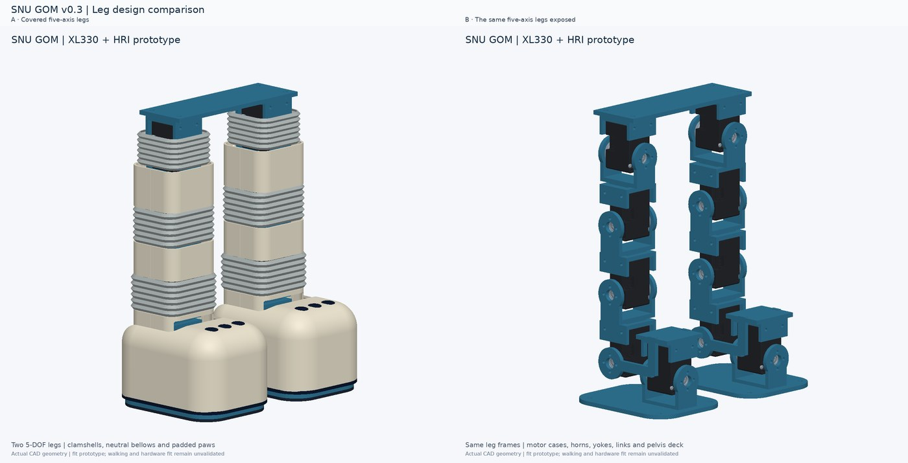

[English](#english) | [한국어](#한국어)

# Import the SNU GOM shell or skeleton into Onshape

Use the v0.3 CAD package from this project conversation. It contains four useful STEP assemblies:

| Model | STEP file | Best use |
| --- | --- | --- |
| Full shell | `SNU_GOM_full_shell_assembly.step` | Bear exterior, link-by-link panels, and neutral soft-joint sleeve envelopes. |
| Full skeleton | `SNU_GOM_skeleton_assembly.step` | Inspect the load path and all 11 XL330 motor assemblies without cosmetic shells. |
| Leg pair with shell | `SNU_GOM_leg_pair_shell.step` | Recommended first import: both five-DOF legs, pelvis deck, paw shells and pads. |
| Leg pair skeleton | `SNU_GOM_leg_pair_skeleton.step` | Compare the exposed motors, brackets and links against the shell version. |

The package also includes one-leg close-ups and separate custom leg-part STEP/STL files. STEP is an exchange format: it carries positioned geometry, not the original feature history or working joints. These are fit prototypes, not manufacturing-qualified parts.

### Visual guide

The bilateral leg STEP files show the same five-axis chain in two presentation styles. The motor cases and link brackets remain the structural parts; the outer shells are separate panels. For a closer look at link and foot details, see the [leg detail view](images/cad-v03/03_leg_detail.jpg). / 양쪽 다리의 5축 구조를 외장형과 골격형으로 비교한 그림입니다. [다리 상세 보기](images/cad-v03/03_leg_detail.jpg)

## 1. Import the STEP file

1. Download and unzip `SNU_GOM_CAD_Shell_Skeleton_v03.zip` from the project conversation.
2. In Onshape's Documents page, choose **Create → Import files** (or create a document and use **Import** to add a tab). Select one `.step` file. Use the `leg_pair` file for your first test.
3. Keep the units at **millimetres**. Do not scale the model by eye.
4. Open the imported tab and inspect the Parts list. Onshape may present a STEP assembly directly or convert its separate solids into a Part Studio. Confirm that the motor cases, horns, links and cover panels are separate instances before building mates.
5. If you have a Part Studio, create/open an **Assembly** tab. Use **Insert** to select its parts. While the Insert dialog is active, select/place them there to retain the Part Studio's relative positions; clicking in the graphics area places them at the cursor instead. Avoid inserting the whole Part Studio as one rigid instance if you need to articulate its leg links.
6. In the leg-pair model, right-click the `pelvis_motor_deck` and choose **Fix**. For the full robot, use the pelvis deck as the root and fasten the torso to it.

Onshape's official guides: [Importing files](https://cad.onshape.com/help/Content/uploadfiles.htm), [supported file formats](https://cad.onshape.com/help/Content/File/supported_file_formats.htm), and [inserting parts into an Assembly](https://cad.onshape.com/help/Content/Assembly/insert_parts_and_assemblies.htm).

## 2. Add the five revolute joints on each leg

The design frame is **+X forward, +Y robot-left, +Z up**. Left joints are at Y=+44 mm; right joints are at Y=−44 mm. The origins below are robot-frame coordinates from [`hardware/mechanical/joint_frames_v03.json`](../hardware/mechanical/joint_frames_v03.json).

| Order / motor IDs (L/R) | Joint | Origin XYZ (mm), left / right | Axis |
| ---: | --- | --- | --- |
| 1 / 1, 6 | Hip roll | (0, ±44, 172) | +X |
| 2 / 2, 7 | Hip pitch | (0, ±44, 124) | +Y |
| 3 / 3, 8 | Knee pitch | (0, ±44, 76) | +Y |
| 4 / 4, 9 | Ankle pitch | (0, ±44, 28) | +Y |
| 5 / 5, 10 | Ankle roll | (40, ±44, 22) | +X |

For each joint:

1. Create a **Revolute mate** between the parent structural link and the child structural link in the chain below. Use the motor's cylindrical output axis as an implicit connector only if its center is exactly at the listed origin; otherwise create explicit mate connectors at the listed point.
2. A Revolute mate rotates about the **local Z axis** of its mate connector. Orient that local Z to the listed robot-frame axis: for hip/ankle roll, local Z must point along robot +X; for pitch joints, local Z must point along robot +Y. Check the connector triad before accepting the mate.
3. Fasten the XL330 case/stator and its fixed-side hardware to the parent bracket. Fasten the output horn and moving-side link hardware to the child link. Keep one revolute degree of freedom for that joint; do not add a second revolute between the horn and the child link.
4. Repeat for the other four axes and the other leg. Drag each link or use **Animate** to confirm that only the intended joint rotates and the chain remains connected.

The structural chain is:

| Joint | Parent → child |
| --- | --- |
| Hip roll | `base` / pelvis deck → `hip_roll_link` |
| Hip pitch | `hip_roll_link` → `hip_pitch_link` |
| Knee pitch | `hip_pitch_link` → `knee_pitch_link` |
| Ankle pitch | `knee_pitch_link` → `ankle_pitch_link` |
| Ankle roll | `ankle_pitch_link` → `ankle_roll_link` / foot |

The ankle-roll origin is offset **40 mm forward and 6 mm below** the ankle-pitch origin; do not force those two axes to intersect. This offset is part of the leg geometry and must remain in the assembly and later kinematics.

Onshape defines Revolute motion about the mate connector's Z axis. See its [Revolute mate](https://cad.onshape.com/help/Content/Assembly/revolute_mate.htm), [Mate connector](https://cad.onshape.com/help/Content/Assembly/assembly_mate_connector.htm), and [Mates](https://cad.onshape.com/help/Content/Assembly/mates.htm) guides.

## 3. Attach the shell and check motion

- Fasten hip covers to the hip-roll link, thigh covers to the hip-pitch link, shin covers to the knee-pitch link, and the paw cover/pad to the foot. A rigid cover must stay on one moving link; do not bridge a revolute gap with a rigid panel.
- The shell STEP includes neutral soft-sleeve envelopes to show possible joint concealment. They are not validated fabric or elastomer, and they do not flex in a rigid Onshape Assembly. Suppress/hide them while checking motion; do not fasten one sleeve across both sides of a joint.
- Do not invent servo angle limits from the STEP. Establish limits from the XL330 hardware, bracket clearance, wiring and collision checks. CAD axes are not calibrated Dynamixel command directions.
- The sampled v0.3 motion screen found foot-to-foot intersections at isolated inward hip-roll samples (left −8° or right +8° with other axes neutral). Treat mates as a way to inspect geometry, not proof that a gait or full range is safe.

To collaborate, create a named Onshape version after import, then branch separate workspaces for shell, foot and linkage changes. Share edit access with teammates and merge reviewed work back into the main workspace. See [Versions and history](https://cad.onshape.com/help/Content/Document/versions_and_history.htm) and [sharing documents](https://cad.onshape.com/help/Content/Collaboration/share_documents.htm).

# SNU GOM 외장형·골격형 CAD를 Onshape에 가져오기

이 대화에서 제공된 v0.3 CAD ZIP을 사용합니다. STEP 모델에는 배치된 형상은 있지만 원래 피처 이력이나 구동 관절은 없습니다. 제조 검증 완료 도면이 아니라 조립 검토용 시제품입니다.

| 모델 | STEP 파일 | 용도 |
| --- | --- | --- |
| 전체 외장형 | `SNU_GOM_full_shell_assembly.step` | 곰 외형, 링크별 패널, 중립 유연 관절 커버 외곽 |
| 전체 골격형 | `SNU_GOM_skeleton_assembly.step` | 외장을 제외한 하중 경로와 XL330 모터 11개 확인 |
| 양쪽 다리 외장형 | `SNU_GOM_leg_pair_shell.step` | 첫 가져오기에 권장. 양쪽 5축 다리·골반 데크·발 외장·패드 |
| 양쪽 다리 골격형 | `SNU_GOM_leg_pair_skeleton.step` | 모터·브래킷·링크를 외장형과 비교 |

## 1. STEP 가져오기

1. 이 대화에서 `SNU_GOM_CAD_Shell_Skeleton_v03.zip`을 내려받아 압축을 풉니다.
2. Onshape Documents 페이지에서 **Create → Import files**를 선택하거나, 새 문서에서 **Import**로 탭을 추가하고 `.step` 파일을 선택합니다. 먼저 `leg_pair` 파일로 시험합니다.
3. 단위는 **mm**로 유지합니다. 화면에서 보이는 크기에 맞춰 임의로 스케일하지 않습니다.
4. 가져온 탭의 Parts 목록에서 모터 케이스·혼·링크·외장 패널이 서로 다른 인스턴스로 나뉘었는지 확인합니다. STEP 조립체로 바로 들어올 수도 있고, 여러 솔리드가 든 Part Studio로 변환될 수도 있습니다.
5. Part Studio로 들어왔다면 **Assembly** 탭을 만들고 **Insert**에서 부품을 선택합니다. 원래 상대 위치를 유지하려면 Insert 대화창 안에서 부품을 선택·배치합니다. 그래픽 화면을 클릭하면 커서 위치에 새로 배치됩니다. 다리를 움직여야 하므로 Part Studio 전체를 하나의 강체 인스턴스로 넣지 않습니다.
6. 양쪽 다리 모델에서는 `pelvis_motor_deck`을 우클릭해 **Fix**합니다. 전체 로봇에서는 골반 데크를 기준으로 고정하고 몸통을 Fastened mate로 고정합니다.

Onshape 공식 안내: [파일 가져오기](https://cad.onshape.com/help/Content/uploadfiles.htm), [지원 파일 형식](https://cad.onshape.com/help/Content/File/supported_file_formats.htm), [Assembly에 부품 넣기](https://cad.onshape.com/help/Content/Assembly/insert_parts_and_assemblies.htm).

## 2. 다리마다 회전 관절 5개 만들기

로봇 좌표는 **+X 전방, +Y 로봇 왼쪽, +Z 위쪽**입니다. 왼쪽 다리는 Y=+44 mm, 오른쪽은 Y=−44 mm입니다. 아래 좌표는 [`hardware/mechanical/joint_frames_v03.json`](../hardware/mechanical/joint_frames_v03.json)의 로봇 기준 좌표입니다.

| 순서 / 모터 ID (좌/우) | 관절 | 원점 XYZ (mm), 좌/우 | 축 |
| ---: | --- | --- | --- |
| 1 / 1, 6 | 고관절 롤 | (0, ±44, 172) | +X |
| 2 / 2, 7 | 고관절 피치 | (0, ±44, 124) | +Y |
| 3 / 3, 8 | 무릎 피치 | (0, ±44, 76) | +Y |
| 4 / 4, 9 | 발목 피치 | (0, ±44, 28) | +Y |
| 5 / 5, 10 | 발목 롤 | (40, ±44, 22) | +X |

관절마다 다음 순서로 진행합니다.

1. 아래 링크 연결표에 따라 부모 구조 링크와 자식 구조 링크 사이에 **Revolute mate** 하나를 만듭니다. 모터의 원통형 출력축 중심이 표의 원점과 정확히 일치할 때만 자동 Mate connector를 사용합니다. 다르면 표의 좌표에 명시적 Mate connector를 둡니다.
2. Onshape Revolute mate는 Mate connector의 **로컬 Z축**을 중심으로 회전합니다. 커넥터의 Z축을 표의 로봇 기준 축에 맞춥니다. 롤은 로봇 +X, 피치는 로봇 +Y 방향입니다. Mate를 승인하기 전에 축 삼축 표시를 확인합니다.
3. XL330 케이스/고정자와 고정측 부품은 부모 브래킷에 Fastened mate로 고정하고, 출력 혼과 움직이는 쪽 링크 부품은 자식 링크에 고정합니다. 관절당 회전 자유도는 하나만 남깁니다. 혼과 자식 링크 사이에 추가 Revolute mate를 만들지 않습니다.
4. 반대편 다리도 반복한 후 각 링크를 드래그하거나 **Animate**로 원하는 관절만 회전하는지 확인합니다.

| 관절 | 부모 → 자식 |
| --- | --- |
| 고관절 롤 | `base` / 골반 데크 → `hip_roll_link` |
| 고관절 피치 | `hip_roll_link` → `hip_pitch_link` |
| 무릎 피치 | `hip_pitch_link` → `knee_pitch_link` |
| 발목 피치 | `knee_pitch_link` → `ankle_pitch_link` |
| 발목 롤 | `ankle_pitch_link` → `ankle_roll_link` / 발 |

발목 롤 원점은 발목 피치보다 **앞으로 40 mm, 아래로 6 mm** 이동했습니다. 두 축을 한 점에 강제로 맞추지 마세요. 이 오프셋은 기구와 역기구학에 유지해야 합니다.

공식 설명: [Revolute mate](https://cad.onshape.com/help/Content/Assembly/revolute_mate.htm), [Mate connector](https://cad.onshape.com/help/Content/Assembly/assembly_mate_connector.htm), [Mates](https://cad.onshape.com/help/Content/Assembly/mates.htm).

## 3. 외장 고정과 동작 확인

- 고관절 커버는 고관절 롤 링크, 허벅지 커버는 고관절 피치 링크, 종아리 커버는 무릎 링크, 발 외장·패드는 발에 Fastened mate로 연결합니다. 경질 패널 하나가 회전 관절 틈을 가로지르면 안 됩니다.
- 외장형 STEP에는 관절을 가릴 수 있는 중립 유연 커버 외곽이 들어 있습니다. 검증된 천/탄성체가 아니며 Onshape의 강체 조립에서는 접히지 않습니다. 동작 확인 중에는 숨기거나 억제하고 관절 양쪽을 한 슬리브로 동시에 고정하지 않습니다.
- STEP만 보고 서보 각도 한계를 정하지 않습니다. XL330 실물, 브래킷 간극, 배선, 충돌 검사를 바탕으로 한계를 정합니다. CAD 축의 양수 방향은 교정된 Dynamixel 명령 방향과 같다고 가정하지 않습니다.
- v0.3 표본 검사에서 다른 축이 중립일 때 내측 고관절 롤 (왼쪽 −8° 또는 오른쪽 +8°)에서 발끼리 간섭했습니다. Mate로 형상을 움직여 볼 수 있어도 보행이나 전체 가동 범위가 안전하다는 뜻은 아닙니다.

협업 전 가져온 상태를 named version으로 저장하고, 외장·발·링크 변경은 별도 workspace로 분기합니다. 팀원에게 편집 권한을 공유하고 검토한 변경만 주 workspace에 병합합니다. [Versions and history](https://cad.onshape.com/help/Content/Document/versions_and_history.htm)와 [문서 공유](https://cad.onshape.com/help/Content/Collaboration/share_documents.htm)를 참고하세요.
