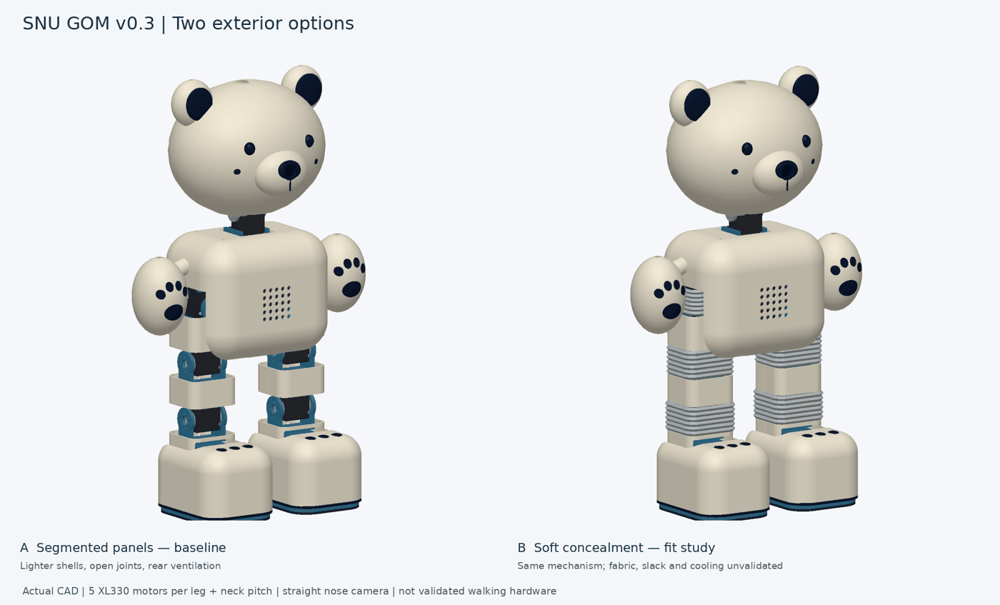

# Paper-informed design / 논문 기반 설계

**2026-10-04 · CAD v0.3 · prototype decisions, not validated performance / 시제품 설계이며 성능 검증 결과가 아닙니다.**

[CAD layout / CAD 구조](CAD_GEOMETRY.md) · [Verification / 검사 결과](CAD_VERIFICATION.md) · [Research / 자료조사](RESEARCH.md)

## English

SNU GOM keeps its cream bear face, large paws, straight nose camera, fixed arms and eleven XL330-M288-T motors. The rigid-panel baseline uses lighter link covers with open joint gaps; the v0.3 shell-on STEP pairs those panels with neutral flexible sleeves. Matching shell and skeleton STEP assemblies are available for the full robot and the paired legs. The shell style remains a prototype choice: neither paper establishes which exterior people prefer in a controlled comparison.

### What the papers changed

| Evidence | SNU GOM change | What remains to establish |
| --- | --- | --- |
| **BD-X, pp. 3–4:** develop character motion, proportions and mechanisms together; its robot also has shells. | Keep each rigid panel on one moving link. Preserve the bear silhouette and author small look/sway/bow references before designing a walking style. | Kinematic references do not establish balance. Long leg proportions still need further packaging work if a shorter teddy silhouette is required. |
| **Olaf, p. 3:** a deformable foam skirt and stretch costume conceal the mechanism. | Keep the eight neutral sleeve envelopes out of the rigid-panel baseline, then pair them with link-mounted panels in the shell-on full-body and paired-leg exports. | Fabric pattern, fastening, fold allowance, snagging, current and cooling tests. The STEP is not a printable, validated flexible joint. |
| **Olaf, pp. 5–7:** the large head and costume make thermal behavior part of motion design. | Lighten upper head and body skins, retain mounting bands, add rear head/body vents and small rear leg-panel slots. | Shell stiffness and actual cooling. The same electronics and one neck-pitch motor remain provisional. |
| **BD-X, p. 3; Olaf, pp. 3, 5, 7:** compliant feet and impact-aware control matter. | Add replaceable 2 mm sole-pad samples with underside screw access. Preserve the flat structural sole and active ankle roll. | Choose foam/elastomer after measuring friction, compression, wear and sound. A soft pad alone does not guarantee quiet walking. |
| **BD-X, pp. 5–8:** animation references help define gait style; velocity-only walking can shuffle. | Specify standing/look, periodic short waddle and episodic greeting families, with reference tracking, contact timing and regularization objectives. | Train only after the CAD, masses, actuator model and simulator agree. No policy was trained in this revision. |
| **Olaf, pp. 4–7:** collision, impact and temperature objectives improve physical behavior. | Add foot-foot avoidance, touchdown impact and calibrated thermal objectives to the motion design specification. Expand CAD screening to both legs. | Reward weights, thermal model and thresholds require XL330 measurements; reward penalties are not hard guarantees. |

These are engineering applications of the papers, not dimensions or material prescriptions taken from them. The nominal 1.2 mm skin zones, 2 mm pads and vent geometry are our prototype choices.

### Mechanical choices

- **Mass:** planning estimate falls from 1,049.6 g to **980.3 g**. Rigid custom geometry is 502.7 g at a reference density of 1.24 g/cm³; two pads add 6.6 g at an assumed 0.30 g/cm³; component allowances total 471 g. The previous total included optional sleeve geometry at the rigid reference density. The comparison combines shell lightening and removal of that option, not measured weight savings.
- **Head:** custom head parts fall from approximately 125.6 g to **109.5 g**, before camera/audio/wiring allowances. The lower head attachment band remains. No claim that one XL330 can carry the complete head continuously is made.
- **Mounts:** structural brackets, motor placement, output horns, rear idlers, fasteners and all eleven joint frames are unchanged. Only cosmetic skins lose material; the two pads introduce new baseline parts.
- **Concealment:** rigid panels conceal portions of the mechanism and guide rear wiring. The rigid-panel baseline leaves joint gaps open; the shell-on STEP adds neutral sleeve envelopes over those gaps. The envelopes are packaging studies, not validated moving fabric covers. Neither model contains the actual wire harness.

### Five joints do not imply the same leg

| Arrangement | Axes | Reason to compare |
| --- | --- | --- |
| Current SNU GOM | Hip roll, hip pitch, knee pitch, ankle pitch, ankle roll | Retains active foot roll and the existing XL330 geometry. No independent hip yaw. |
| BD-X-inspired alternative | Hip yaw, hip roll, hip pitch, knee pitch, ankle pitch | Adds yaw for turning; BD-X uses rounded soles for passive roll. Requires new mechanical/contact modeling. |

Keep the current CAD as baseline. Compare supported standing, short forward steps, side-to-side shifts and small turns with matched mass/actuator assumptions before changing the topology. Olaf's asymmetric six-joint legs solve a different packaging problem and are not adopted here.

### Motion and HRI boundary

The new files in [`motion/design/`](../motion/design/) are **design inputs**, not runtime configuration. `reference_clips.json` contains kinematic look, sway and greeting-dip ideas (a full bow still needs torso-orientation design); `character_motion_spec.json` specifies behavior families, objectives and missing calibration. Both explicitly disable hardware use. The current ten-joint proxy URDF still differs from the detailed eleven-joint CAD.

The camera/dialogue system selects an available behavior intent. Local control owns balance and joint targets; audio and listening indication remain separate show functions. API latency must not drive the walking loop. Both source robots use puppeteering in the reported systems, so their papers do not provide SNU GOM's autonomous dialogue/perception stack.

Use measured current, temperature, voltage and joint feedback. The official XL330 manual lists **0.52 N·m stall at 5 V** and a **70°C default temperature limit**. Stall torque is not a continuous allowance. Do not copy Olaf's 80°C experimental threshold or either paper's control rates. The specification leaves gains, current limits, thermal thresholds and loop rates unset pending bench characterization.

### Next experiment

1. Fit one shell pair and a sole-pad sample; verify retention, screw access and print stiffness.
2. Use supported hardware to compare open joints versus the soft-cover option with the same poses and duration. Log mass, peak/RMS current, temperature trend, cable rubbing, assembly access and motion quality.
3. Update the simulator from the CAD frames and weighed parts; identify the XL330 response, friction, latency and heating before RL.
4. Compare contact materials at matched walking speed and microphone position; record foot slip and sound as well as tracking error.

The bilateral CAD screen already rejects isolated inward hip roll at −8° left or +8° right with the other joints neutral because the feet intersect. Coordinated ±4° sway samples are clear in the screened geometry. These are samples, not certified joint ranges.

## 한국어

크림색 곰 얼굴·큰 발·정면 코 카메라·고정 팔·XL330-M288-T 11개를 유지합니다. 경질 패널 기준안은 **가벼운 분절형 외장과 열린 관절 틈**이며, v0.3 외장형 STEP은 패널에 **중립 유연 슬리브 외곽**을 더합니다. 전체 로봇과 양쪽 다리의 외장형·골격형 STEP을 제공하며, 두 논문은 외형 선호를 통제 실험으로 결론 내리지는 않았습니다.

### 실제 반영 내용

| 논문 근거 | SNU GOM 변경 | 남은 검증 |
| --- | --- | --- |
| **BD-X 3–4쪽:** 캐릭터 동작·비율·기구를 함께 설계하며 이 로봇도 외장이 있음 | 경질 패널은 하나의 링크에만 부착. 올려다보기·흔들림·인사 참조부터 정의 | 참조 자세의 균형과 보행은 미검증. 더 짧은 곰 다리 비율은 추가 배치 설계가 필요 |
| **Olaf 3쪽:** 폼 스커트와 신축성 의상으로 관절을 감춤 | 중립 슬리브 8개를 경질 패널 기준안에서는 분리하고, 외장형 전체·양쪽 다리 STEP에서는 링크별 패널과 결합 | 원단 패턴·고정·접힘 여유·끼임·전류·통풍. STEP는 검증된 유연 출력물이 아님 |
| **Olaf 5–7쪽:** 큰 머리와 의상 때문에 온도를 동작 설계에 반영 | 머리·몸통 상부/중앙 외장을 경량화하고 고정부 유지. 머리·몸통·다리 뒤 통풍 슬롯 추가 | 외장 강성과 실측 방열. 전장 후보 및 목 피치 1개 구성의 하중 검증 |
| **BD-X 3쪽, Olaf 3·5·7쪽:** 유연 발과 충격 저감 제어 | 교체형 2 mm 발바닥 패드와 하부 나사 접근공 추가. 평평한 구조 발판·능동 발목 롤 유지 | 마찰·압축·마모·소음 시험으로 재질 결정 |
| **BD-X 5–8쪽:** 애니메이션 참조가 보행 스타일에 기여 | 기립/시선, 주기적 짧은 뒤뚱걸음, 일회성 인사와 참조·접촉·정규화 목표 명시 | CAD·질량·모터 모델·시뮬레이터 일치 후 학습. 이번에 학습한 정책은 없음 |
| **Olaf 4–7쪽:** 충돌·착지 충격·온도 목표 | 양발 충돌 회피·착지 충격·교정된 온도 목표와 양쪽 다리 CAD 검사 추가 | 보상 계수·열 모델·임계값 실측 필요. 보상은 강제 제한을 보장하지 않음 |

1.2 mm 경량 구간·2 mm 패드·통풍구 치수는 우리 시제품 설계값이며 논문에 제시된 SNU GOM용 치수가 아닙니다.

### 질량과 기구

전체 계획 질량은 **1,049.6 → 980.3 g**, 머리 자체 제작 부품은 약 **125.6 → 109.5 g**입니다. 경질 부품은 기준 밀도 1.24 g/cm³에서 502.7 g, 패드는 가정한 폼 밀도 0.30 g/cm³에서 6.6 g, 구입 부품·배선 등 여유값은 471 g입니다. 이전 값에는 유연 슬리브도 경질 기준 밀도로 포함되어 있었습니다. 따라서 경량화와 비교안 제외가 함께 반영된 추정값이며 실측 감량이 아닙니다.

하중을 받는 브래킷·모터 배치·제공된 혼/아이들러/나사·11개 관절 좌표는 유지합니다. 경질 패널 기준안은 관절 틈을 열어 두고, 외장형 STEP은 중립 슬리브 외곽으로 틈을 덮습니다. 슬리브는 움직이는 원단으로 검증되지 않았으며 두 모델 모두 실제 하네스 솔리드를 포함하지 않습니다.

현재 다리는 **고관절 롤·피치 / 무릎 피치 / 발목 피치·롤**, BD-X는 **고관절 요·롤·피치 / 무릎 피치 / 발목 피치**입니다. BD-X의 둥근 발은 수동 롤을 허용합니다. 우선 현재안을 유지하고 같은 질량·모터 조건에서 기립·짧은 전진·좌우 이동·작은 회전을 비교한 뒤 축 구성을 바꿉니다. Olaf의 비대칭 6축은 채택하지 않았습니다.

### 제어와 HRI

[`motion/design/`](../motion/design/)의 파일은 실행 설정이 아닌 **설계 입력**입니다. 참조는 올려다보기·좌우 흔들림·작은 낮춤 인사이며 전신 인사는 몸통 기울기 설계가 더 필요합니다. 실제 모터 사용은 비활성화되어 있습니다. 기존 10축 도형 URDF는 상세 11축 CAD와 아직 다릅니다.

카메라·대화 시스템은 사용 가능한 행동 의도를 고르고 로컬 제어기가 균형과 관절 목표를 담당합니다. 음성·청취 표시를 별도 표현 기능으로 두며 인터넷 응답 시점에 보행이 의존하지 않게 합니다. 두 논문의 시연 시스템은 조종자가 있으므로 자율 대화·인지 기능까지 제공하는 근거는 아닙니다.

XL330 공식값은 **5 V 스톨 토크 0.52 N·m**, **기본 온도 제한 70°C**이며 스톨은 연속 허용 토크가 아닙니다. Olaf의 80°C 실험 기준과 논문의 제어 주기를 복사하지 않습니다. 전류·온도·전압·관절 응답을 기록한 후 이득·한계·주기를 정하도록 미확정값을 비워 두었습니다.

다음 순서는 외장 한 쌍/패드 시편 → 지지된 하드웨어에서 외피 유무 비교 → 실측 질량과 관절을 반영한 시뮬레이터 → 모터 특성 식별·기립·보행 학습입니다. 비교 시 질량·전류·온도·배선 마찰·정비성·동작 품질을 함께 기록합니다.

양쪽 다리 검사에서 다른 축이 중립일 때 **왼쪽 고관절 롤 −8° / 오른쪽 +8°의 독립 내측 기울임**은 발끼리 간섭합니다. **양쪽을 함께 움직이는 ±4° 흔들림** 표본은 검사 형상에서 간섭이 없었습니다. 연속 가동 범위가 확정된 것은 아닙니다.

## Sources / 원문

- Grandia et al., **Design and Control of a Bipedal Robotic Character**, RSS 2024. [Author page and video](https://la.disneyresearch.com/publication/design-and-control-of-a-bipedal-robotic-character/) · [Proceedings PDF](https://www.roboticsproceedings.org/rss20/p103.pdf). Page references above use the supplied 14-page paper.
- Müller et al., **Olaf: Bringing an Animated Character to Life in the Physical World**, [arXiv:2512.16705v2](https://arxiv.org/abs/2512.16705v2), 2 April 2026. Page references use the supplied 8-page version.
- ROBOTIS, [XL330-M288-T e-Manual](https://emanual.robotis.com/docs/en/dxl/x/xl330-m288/), checked 2026-10-04.
