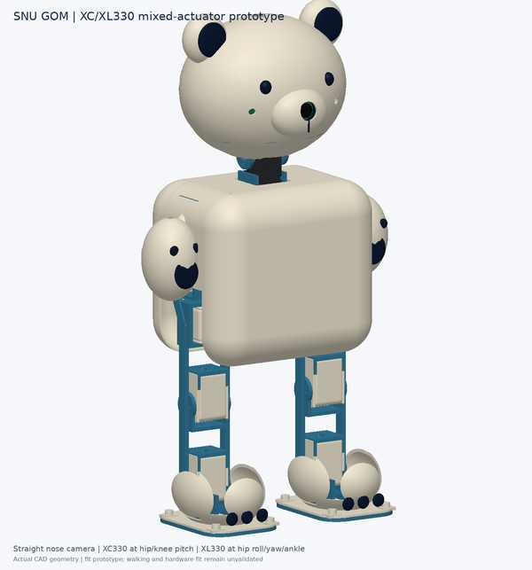
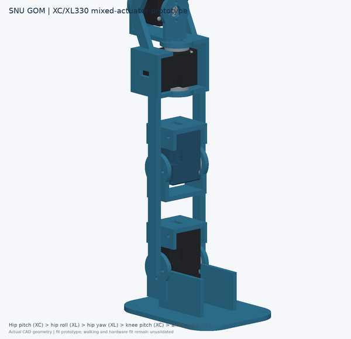
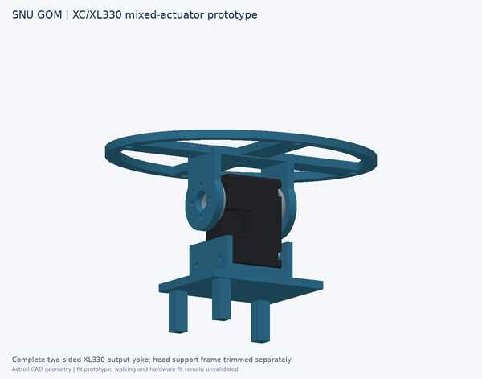

# Mechanical CAD / 기구 CAD

**Current revision: v0.7 · taller shoulder-level body · mixed XC/XL motors**

**최신 버전: v0.7 · 어깨 높이 몸통 · XC/XL 혼합 모터**

## Previews / 미리보기

| Full robot / 전체 로봇 | Leg layout / 다리 배치 | Head horn / 머리 혼 |
|---|---|---|
|  |  |  |

## Dimensions / 치수

The shell-covered prototype is **403 mm tall (40.3 cm)**, overall 124.75 × 220 × 403 mm. The internal skeleton is 107 × 174 × 348.5 mm. The torso/shoulder/head package is 35 mm higher than v0.5 to house the proximal motors up to shoulder height.

외장형 시제품 높이는 **403 mm(40.3 cm)**이며 전체 크기는 124.75 × 220 × 403 mm입니다. 내부 골격은 107 × 174 × 348.5 mm입니다. 근위부 모터를 어깨까지 수용하도록 v0.5보다 몸통·어깨·머리 배치를 35 mm 높였습니다.

| Model / 모델 | Bounds X × Y × Z (mm) |
|---|---:|
| Full shell / 전체 외장형 | 124.75 × 220 × 403 |
| Internal assembly / 내부 조립체 | 107 × 174 × 348.5 |
| Leg pair shell / 양쪽 다리 외장형 | 99.5 × 174 × 257 |
| Leg pair skeleton / 양쪽 다리 골격형 | 99.5 × 174 × 260.75 |
| One leg shell / 한쪽 다리 외장형 | 99.5 × 66 × 257 |
| One leg skeleton / 한쪽 다리 골격형 | 99.5 × 66 × 254.5 |

## Actuators / 모터

Each leg uses XC330-M288-T at hip pitch and knee pitch; XL330-M288-T at hip roll, hip yaw and ankle pitch. The neck uses one XL330. Total: four XC330 and seven XL330. The stronger units are assigned to the trunk-supporting hip pitch and the other likely high-load sagittal joint, knee pitch. This is a preliminary assignment pending measured mass/COM and gait torque analysis.

각 다리의 고관절 피치·무릎 피치에 XC330-M288-T, 고관절 롤·요·발목 피치에 XL330-M288-T를 사용합니다. 목에는 XL330 1개를 사용합니다. 총 XC 4개, XL 7개입니다. 강한 모터를 상체를 지지하는 고관절 피치와 다음 고부하가 예상되는 무릎 피치에 두는 초기안이며, 실측 질량/무게중심과 보행 토크 분석이 남아 있습니다.

The uploaded STEP uses the same outer M288 case/horn geometry for both types; it cannot show internal motor differences. CAD component names/colors and joint metadata mark the four XC units. The earlier head carrier clipped the horn yoke during ellipsoid trimming; v0.7 keeps the full two-sided yoke and trims only the support frame.

첨부 STEP은 두 모터의 공통 외형 M288 케이스/혼을 사용하므로 내부 모터 차이는 표시하지 않습니다. CAD 부품 이름/색과 조인트 메타데이터로 XC 4개를 구분합니다. 이전 머리 캐리어는 타원체 Boolean에 혼 요크가 잘릴 수 있었지만 v0.7은 양쪽 요크 전체를 유지하고 지지 프레임만 다듬습니다.

## Release and verification / 배포 및 검증

The STEP files were generated and verified locally; full-shell re-import contains 244 valid solids and the internal assembly 203. This GitHub review branch contains design metadata and preview images, but not the large STEP binaries. The compressed v0.7 package is provided separately in this design review. Geometry checks do not establish fit, strength, current/thermal margin, collision-free motion, balance or walking. See [geometry](../../docs/CAD_GEOMETRY.md), [verification](../../docs/CAD_VERIFICATION.md) and [electronics/power](../../docs/ELECTRONICS.md).

STEP 파일은 로컬에서 생성·검증했으며 전체 외장 재가져오기에서 유효 솔리드 244개, 내부 조립체에서 203개를 확인했습니다. 이 GitHub 검토 브랜치에는 설계 메타데이터와 미리보기만 있고 대용량 STEP 바이너리는 포함하지 않았습니다. 압축된 v0.7 패키지는 이번 설계 검토에서 별도 제공했습니다. 형상 검사는 조립 적합성·강도·전류/발열 여유·동작 간섭·균형·보행 검증이 아닙니다. [CAD 형상](../../docs/CAD_GEOMETRY.md), [검증 한계](../../docs/CAD_VERIFICATION.md), [전장·전원](../../docs/ELECTRONICS.md)을 참고하세요.
